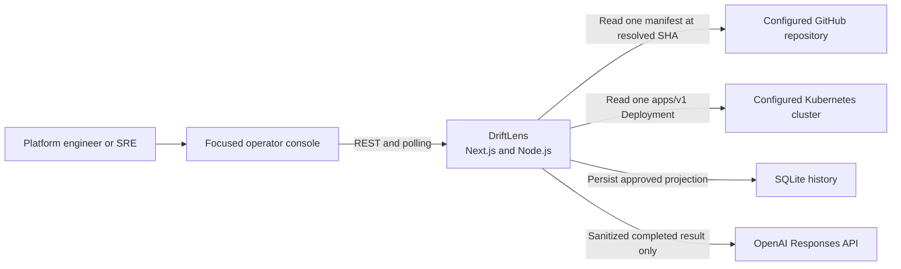
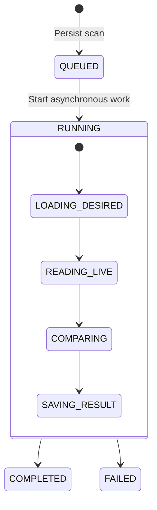
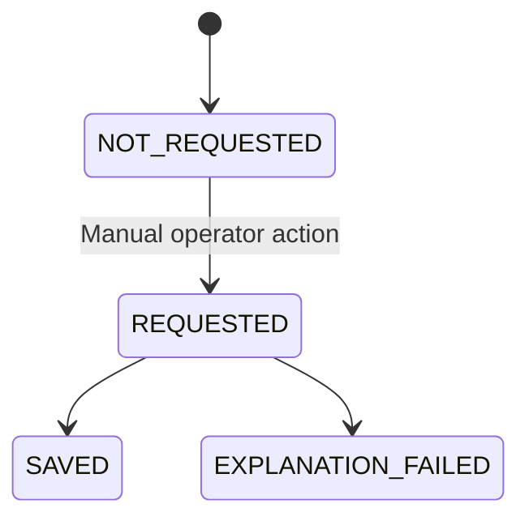

# DriftLens MVP Architecture

Status: proposed record of approved issue #4; pending pull-request review
Architecture specification: GitHub issue #4
Product scope: [PRD](./PRD.md)

## 1. Decision summary

DriftLens MVP is a self-hosted TypeScript modular monolith:

- Next.js App Router provides the React operator UI and REST API boundary.
- Framework-neutral application and domain modules execute scans and compare
  the supported Kubernetes fields.
- GitHub REST and the official Kubernetes JavaScript client provide desired
  and live state through narrow adapters.
- File-backed SQLite persists scan state, stages, results, history, and AI
  explanations.
- The OpenAI Responses API produces a manually requested, structured
  explanation from sanitized deterministic results.
- One long-lived Node.js process runs outside Kubernetes. A local `kind`
  cluster contains only the demo Deployment.

This is one deployable application, not one undifferentiated module. The
boundaries below preserve testability and allow a future service split without
paying that operational cost in the 2–4 hour MVP Core timebox.

## 2. System context

The browser never connects directly to GitHub, Kubernetes, SQLite, or OpenAI.
All credentials and external-service calls remain server-side.

## 3. Application boundaries

### Operator UI

Responsibilities:

- identify the configured repository and Deployment target;
- initiate one scan;
- poll and present basic progress;
- show outcome, supported field differences, and actionable failures;
- list and open persisted scans; and
- manually request and display an explanation.

The UI consumes the same REST API available to other clients. It contains no
Git, Kubernetes, persistence, comparison, or AI logic.

### REST API

The API exposes product capabilities for:

- creating a scan;
- retrieving scan state and detail;
- listing scan history;
- requesting an explanation; and
- reporting health and readiness.

Route Handlers validate inputs, invoke application services, and translate
typed results or errors into HTTP responses. Exact paths and schemas belong to
the relevant vertical-slice specifications.

### Scan application service

The application layer owns workflow sequencing:

1. create and persist a queued scan;
2. load and validate desired state;
3. read live state;
4. invoke the deterministic comparator;
5. persist the result or actionable failure; and
6. expose current state to the API.

It depends on interfaces for desired state, live state, persistence, and
explanation generation. It does not import Next.js UI code or concrete
external clients.

### Deterministic domain

Pure TypeScript domain functions own:

- supported manifest projection and validation;
- replicas defaulting;
- desired-container matching by name;
- exact image comparison;
- drift outcome classification; and
- field-level difference construction.

The domain accepts already loaded data and performs no network, filesystem,
database, logging, or AI calls. Deterministic output is the sole drift truth.

### Adapters

Adapters translate external systems into narrow application contracts:

- GitHub adapter: resolve a branch or SHA and load one configured YAML path.
- Kubernetes adapter: read one namespaced `apps/v1` Deployment.
- SQLite adapter: persist and retrieve the approved record projection.
- OpenAI adapter: generate and validate a sanitized structured explanation.

External client objects remain behind these adapters so unit tests can use
deterministic fakes.

## 4. Scan state flow

One running process handles at most one active scan. A simple in-memory
coordinator rejects a second start request with a structured conflict. This
bounds resource use without adding durable leases, distributed locks, or
concurrent-scan coordination.

Explanation state is subordinate to, and independent of, scan execution:

The public execution statuses remain `QUEUED`, `RUNNING`, `COMPLETED`, and
`FAILED`. Named running stages provide progress without creating additional
execution statuses.

The start request persists `QUEUED` before returning `202 Accepted`. A
self-hosted Next.js Route Handler schedules
`after(() => scanService.run(scanId))`; the long-lived Node.js process
continues the scan while the UI polls. Core adds no interruption-recovery or
shutdown-drain workflow and does not resume unfinished work after termination.

Core has no overall workflow timeout, automatic retry, cancellation, or
restart resumability. Each GitHub, Kubernetes, and OpenAI transport call still
uses a bounded client or abort timeout so one hung dependency cannot occupy
the sole active-scan slot indefinitely.

After process restart, the in-memory active marker is empty. Any previously
persisted `QUEUED` or `RUNNING` record remains unchanged as evidence; Core does
not resume, complete, delete, or otherwise recover it. A new scan may start in
the new process.

An explanation is a separate manual operation available only for
`IN_SYNC`, `DRIFTED`, and `MISSING_LIVE`. Explanation failure is persisted
without changing the completed scan or deterministic outcome.

## 5. Desired and live state

### GitHub desired state

Core uses native server-side `fetch` against the GitHub REST API:

1. accept a branch or commit SHA for the deployment-configured repository;
2. resolve it to an immutable commit SHA;
3. retrieve exactly one configured relative manifest path at that SHA; and
4. parse exactly one YAML document.

The adapter allowlists GitHub, the configured repository identity, and a safe
relative path. It does not clone repositories, invoke shell Git, follow
arbitrary hosts, or accept embedded credentials. Public reads work without
authentication; an optional server-side token may be configured without
entering persisted product data or browser responses.

### Kubernetes live state

Core uses `@kubernetes/client-node` and a server-configured kubeconfig path to
read the Deployment derived from the desired manifest:

- API group and version: `apps/v1`;
- kind: `Deployment`;
- identity: explicit desired namespace and name; and
- operation: one read of the matching Deployment.

The demo credential is read-only and namespace-scoped. Kubernetes
authorization—not application intent alone—must prevent mutation. Missing
Deployment is translated to `MISSING_LIVE`; authentication, authorization, and
availability failures remain execution failures.

## 6. Persistence boundary

Core uses file-backed SQLite through Node 24 `node:sqlite`. A repository
interface isolates synchronous database access from application and domain
logic.

Logical records cover:

- scan identity and requested Git reference;
- resolved immutable commit SHA;
- target API version, kind, namespace, and name;
- execution status, current stage, and timestamps;
- supported desired and live field projections;
- field-level differences and comparison outcome;
- structured execution error;
- explanation state, structured content, error, model identifier, and
  timestamps; and
- ordered stage transitions needed by the Core progress display.

The database never stores:

- Git or OpenAI tokens;
- kubeconfig content;
- complete desired or live manifests; or
- unrelated Kubernetes fields.

Core uses one scan record, one append-only scan-stage collection, and one
explanation representation. SQLite does not implement an admission lease or
advanced lock; the single-process coordinator owns the Core active-scan
boundary.

One idempotent schema bootstrap based on `PRAGMA user_version` and bounded
`CREATE` statements runs during application startup. One connection serves
the single process, and statements remain small and bounded. The database file
lives on a persistent host path or container volume. SQLite fits one process
and assessment-lifetime retention; an ORM, a general migration framework,
PostgreSQL, and distributed coordination are deferred.

`node:sqlite` is currently release-candidate stability. This accepted MVP
trade-off removes an ORM and external native addon but makes Node 24 a runtime
requirement. Local, CI, and deployment environments pin the same Node 24 patch
or container image, and database-using routes explicitly use the Node.js
runtime. A later stability problem can be contained behind the repository
interface.

## 7. AI explanation boundary

The OpenAI adapter uses the official TypeScript SDK, Responses API, and
Structured Outputs.

Server-side configuration supplies:

- `OPENAI_API_KEY`; and
- `OPENAI_MODEL`, initially documented as `gpt-5.6`.

The request contains only:

- deterministic outcome;
- supported desired and live field values;
- field-level differences; and
- bounded instructions for operator-focused analysis.

It excludes credentials, repository authorization details, kubeconfig,
complete manifests, unrelated fields, chat history, and remediation tools.

The structured response contains:

- summary;
- important differences;
- likely operational implications;
- suggested investigation checks; and
- limitations and uncertainty.

The adapter validates the response before persistence. It does not retry
automatically. Refusal, timeout, transport failure, invalid output, or provider
failure becomes an explanation error and never alters scan truth.

## 8. Runtime topology

### Local

- DriftLens runs as a long-lived Node.js process or Docker container on the
  operator-controlled machine.
- `kind` runs the private demo Kubernetes cluster.
- The application reads a configured kubeconfig path.
- SQLite uses a local persistent file.
- The UI and API bind locally and are not publicly exposed.

### Hosted demo

- DriftLens remains outside Kubernetes and reuses the existing Proxmox
  deployment environment, initially on pve1 unless placement is changed
  through an approved decision.
- The private demo cluster runs separately from the DriftLens process.
- CI and application identities remain isolated even if they share pve1.
- The application uses an immutable build tied to the merged commit SHA.
- The existing Cloudflare account, tunnel, proxy, and access-policy
  infrastructure is reused for the hosted Core deployment. Hostname selection
  and route binding wait for release issue #12; direct origin access must not
  bypass Cloudflare protection.

The delivery specification verifies existing configuration before reuse.
Creating or expanding a runner host, deployment identity, Cloudflare account,
domain route, access policy, or permission remains a new user decision.

## 9. Security and trust boundaries

### Product runtime

- Validate every API, configuration, manifest, and external response boundary.
- Keep secrets in runtime configuration only.
- Mask sensitive values in structured logs and errors.
- Mount kubeconfig and deployment credentials read-only where possible.
- Use least-privilege Kubernetes RBAC.
- Restrict GitHub source identity and transport.
- Never mutate Kubernetes.
- Never expose the local origin publicly without the approved external access
  boundary.

Core has no application-managed authentication or authorization. Local mode
relies on operator-controlled network placement; hosted access reuses the
existing Cloudflare protection.

### GitHub Actions

This public repository uses self-hosted environments under a strict trust
model:

| Event | Self-hosted CI | Deployment access |
| --- | --- | --- |
| Push to canonical trusted issue branch | Allowed | None |
| User-approved merge push to protected `main` | Full gates | Least-privilege demo deployment |
| Fork or external pull-request event | Forbidden | Forbidden |
| Comment or `pull_request_target` event | Forbidden | Forbidden |

Workflows use canonical-repository `push` events only. External changes must be
reviewed and copied into a trusted canonical branch before any execution.
Workflow tokens are read-only by default, third-party Actions are pinned to
immutable SHAs, and runner labels are not treated as a security boundary.

CI and deployment need separate runner instances or isolated execution
identities. CI must not have a deployment kubeconfig, Cloudflare credential,
or broad home-lab access. The deployment identity accepts protected `main`
pushes only.

One workflow provides the delivery DAG:

1. every trusted canonical branch push runs the verify job;
2. the same `main` run continues to build one immutable SHA-tagged artifact;
3. deployment waits for verify and build, then uses the isolated deployment
   identity; and
4. smoke verification proves the exact deployed revision.

A single deployment concurrency group queues main revisions rather than
cancelling an in-progress deployment. A second workflow must not duplicate the
full verification or build.

## 10. Observability and failure handling

- Structured logs use levels and include scan and request correlation IDs.
- Logs record stage transitions and error classes, never secret values or full
  manifests.
- Health reports process availability.
- Readiness verifies required configuration and writable persistence without
  depending on GitHub, Kubernetes, or OpenAI being continuously available.
- API errors contain a stable machine-readable code and actionable safe
  message.
- Adapter failures are classified separately from comparison outcomes.

Core stores enough state for the operator to understand a failed scan. It does
not promise recovery of active work after process restart.

## 11. Verification strategy

### Unit

- pure manifest projection and comparison behavior;
- workflow happy, edge, and failure transitions using fakes;
- validation and safe error mapping;
- explanation sanitization and structured response validation; and
- persistence repository behavior against a temporary database.

Unit tests perform no network access.

### Integration

- GitHub adapter behavior against an injected fake HTTP client;
- Kubernetes adapter behavior against an injected fake Kubernetes client;
- SQLite migrations and history queries; and
- API routes against real application services with controlled adapters.

### Operator flow

- One parameterized React component test covers progress, result, history,
  explanation, and failure rendering.
- One Chromium Playwright flow, with one worker and no retries, exercises the
  operator-critical UI/API path.
- One named, single-node `kind` cluster is created by an idempotent demo script
  with a pinned node image and bounded readiness wait.
- The same demo cluster proves `IN_SYNC`, replica and image `DRIFTED`,
  `MISSING_LIVE`, and an invalid-source/path failure retained in history,
  followed by a normal successful scan. This recovery is not a retry feature.
- Explanation-provider failure remains deterministic test evidence rather than
  another live-demo dependency.

Release gates include formatting, lint, strict type checking, unit tests,
production build, affected integration and end-to-end tests, dependency audit,
secret scan, and documentation review.

## 12. Trade-offs and deferred choices

| Choice | Benefit | Accepted cost |
| --- | --- | --- |
| One TypeScript deployable | Fastest complete vertical workflow | Process boundaries are logical, not network-enforced |
| In-process scan execution | No queue or worker operations | No restart resumability or horizontal scaling |
| One active scan per process | Bounded behavior without advanced locks | No concurrent scans or durable admission lease |
| Polling | Simple and observable | Repeated short API requests |
| GitHub REST file retrieval | Narrow source and credential surface | GitHub-only; no full Git semantics |
| SQLite | Durable history without another service | Single-instance persistence |
| Node 24 `node:sqlite` | Minimal dependency surface | Release-candidate API stability |
| Structured AI output | Stable UI/persistence contract | Provider and model dependency |
| DriftLens outside Kubernetes | Simple local and hosted operation | No in-cluster identity in Core |
| Self-hosted push-only CI | Uses existing home-lab delivery path | External PRs receive no automatic CI |

Deferred work remains defined by PRD MVP Extended and Future scope. In
particular: configuration CRUD, private repositories, resource quantities,
cancel/timeout/manual retry, discovery, in-cluster ServiceAccount mode,
new or expanded Proxmox/Cloudflare configuration, multiple clusters,
scheduling, alerts, remediation, authentication, audit retention, and high
availability. CPU and memory requests/limits are the first comparison
enhancement after replicas and images pass.

## 13. Dependency-ordered delivery slices

1. Foundation and enforceable CI trust controls.
2. Deterministic scan, API, persistence, and history.
3. Focused operator UI and visible workflow state.
4. Manual sanitized AI explanation.
5. Local `kind` demo, hosted delivery, documentation, and submission evidence.

Each slice receives a separate approved GitHub issue, worktree, branch, and
pull request. Product implementation begins only after its issue specification
is explicitly approved.

At the owner-feedback checkpoint (`2026-07-30T20:49:46Z`), recorded assessment
work is 85 minutes 51 seconds. The revised remaining-work targets below total
146 minutes, leaving 8 minutes 9 seconds of the four-hour limit. They must be
recalculated from the live ledger before the first implementation issue begins:

| Slice | Target |
| --- | ---: |
| Foundation | 18 minutes |
| Deterministic API and persistence | 47 minutes |
| Operator UI | 27 minutes |
| AI explanation | 12 minutes |
| Demo, deployment, docs, and evidence | 42 minutes |
| Risk reserve | 8 minutes 9 seconds |

New Cloudflare/Proxmox infrastructure, private Git, configuration CRUD, and
resource quantities do not begin inside this Core budget. Core only reuses the
already configured hosted-delivery path.

## 14. Official references

- [Next.js App Router](https://nextjs.org/docs/app)
- [Next.js self-hosting](https://nextjs.org/docs/app/guides/self-hosting)
- [GitHub repository contents API](https://docs.github.com/en/rest/repos/contents)
- [GitHub commits API](https://docs.github.com/en/rest/commits/commits)
- [Kubernetes JavaScript client](https://github.com/kubernetes-client/javascript)
- [Kubernetes RBAC](https://kubernetes.io/docs/reference/access-authn-authz/rbac/)
- [kind quick start](https://kind.sigs.k8s.io/docs/user/quick-start/)
- [Node.js SQLite](https://nodejs.org/api/sqlite.html)
- [OpenAI Structured Outputs](https://developers.openai.com/api/docs/guides/structured-outputs)
- [GitHub Actions secure use](https://docs.github.com/en/actions/reference/security/secure-use)
